## Screenshots

#### Home page without Sign up
  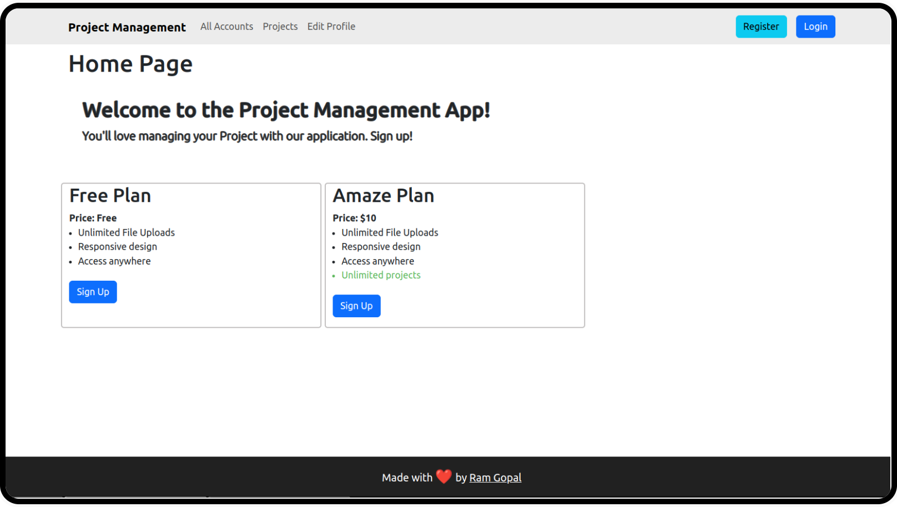

#### Sign up Form
  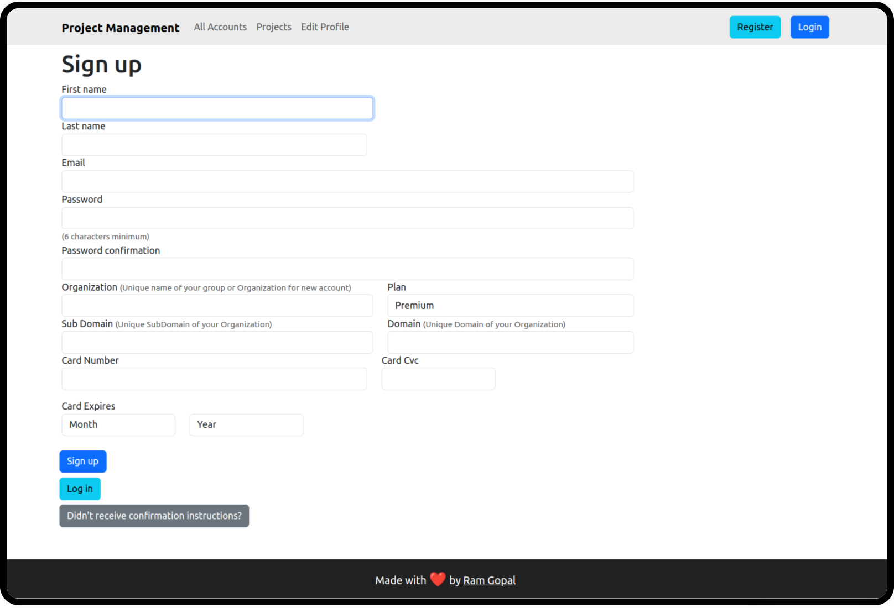

#### Stripe Payment Logs
  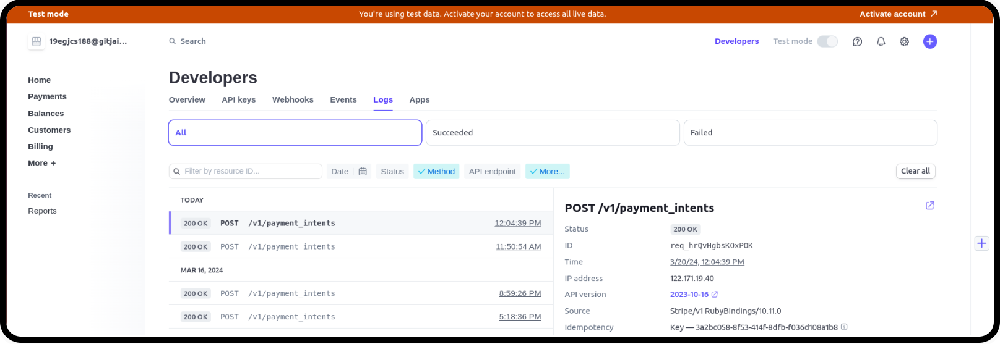

#### User edit, reset password & Resend confirmation link
  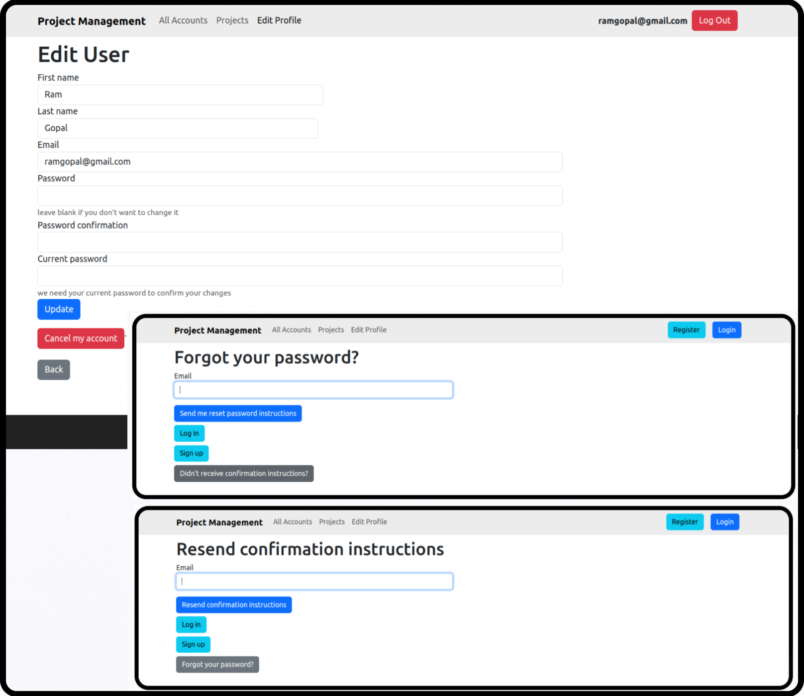

#### Accounts Create, Edit & Update operation
  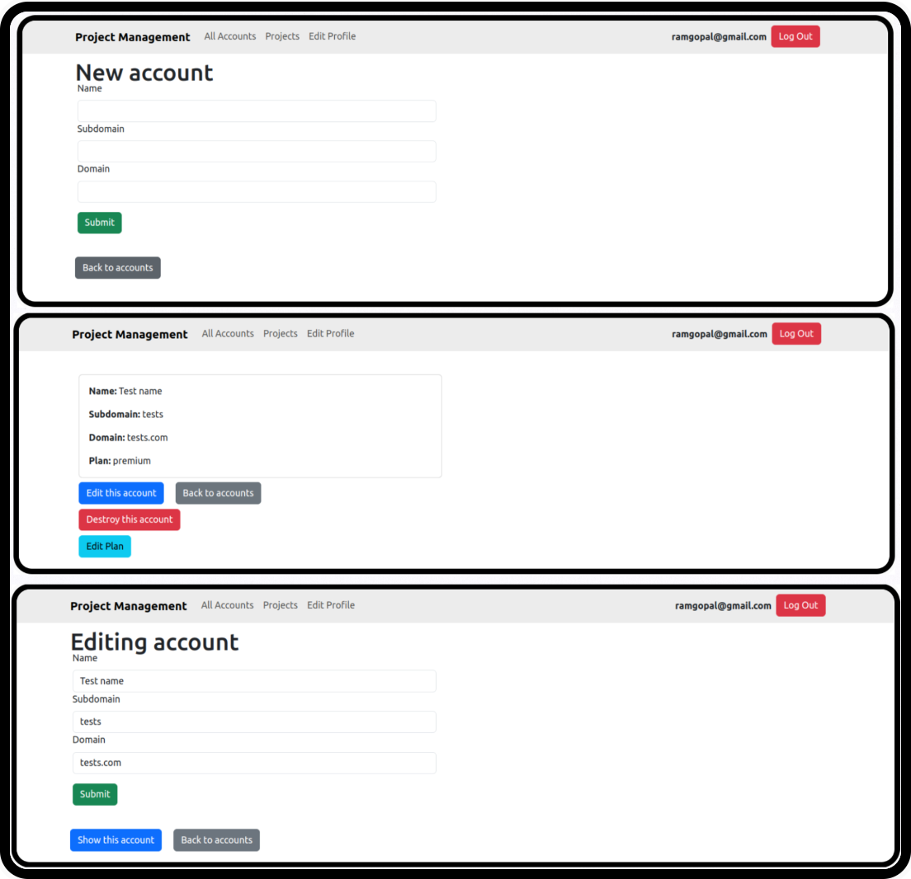

#### Show all Accounts
  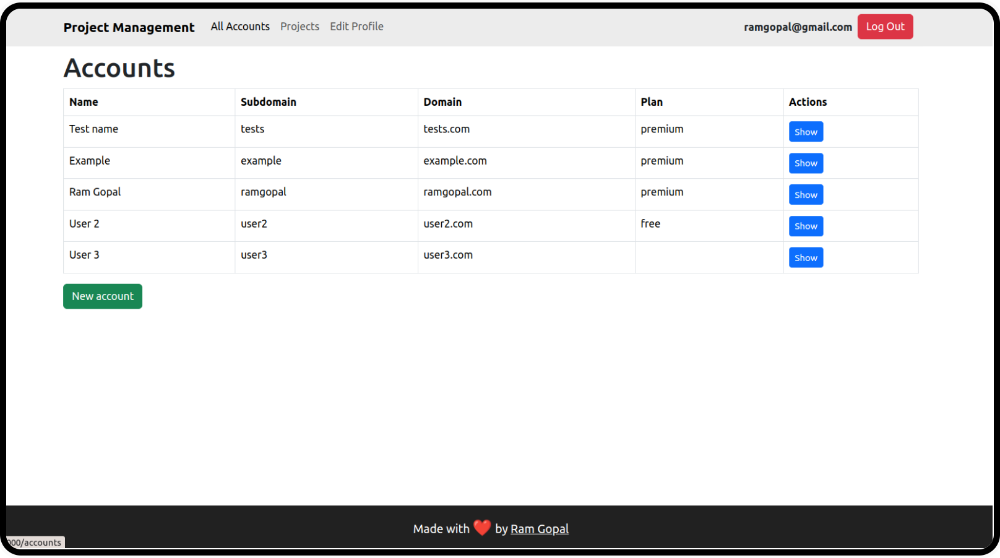

#### Projects Create, Edit operation & Show all projects 
  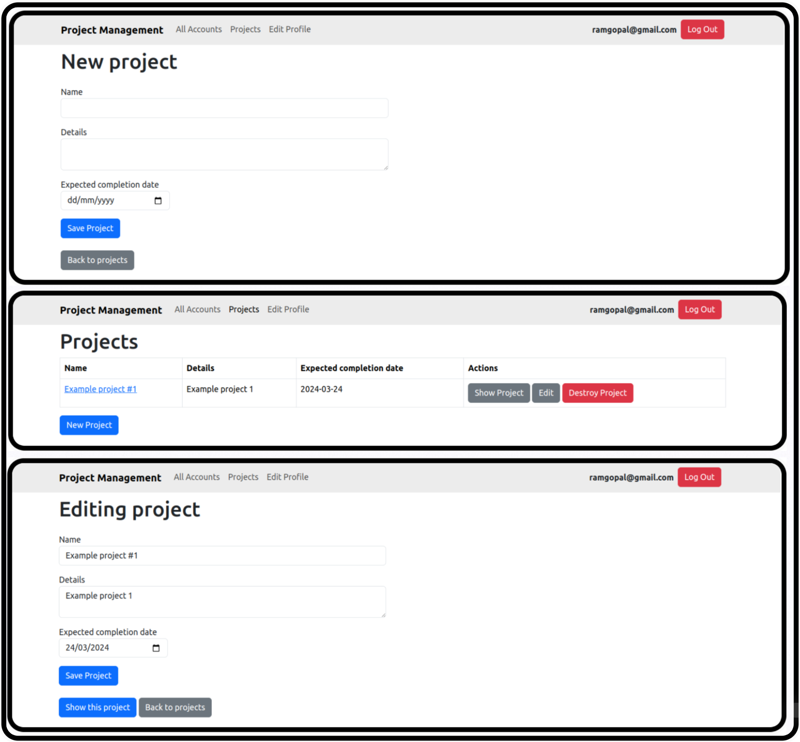

#### Show Project 
  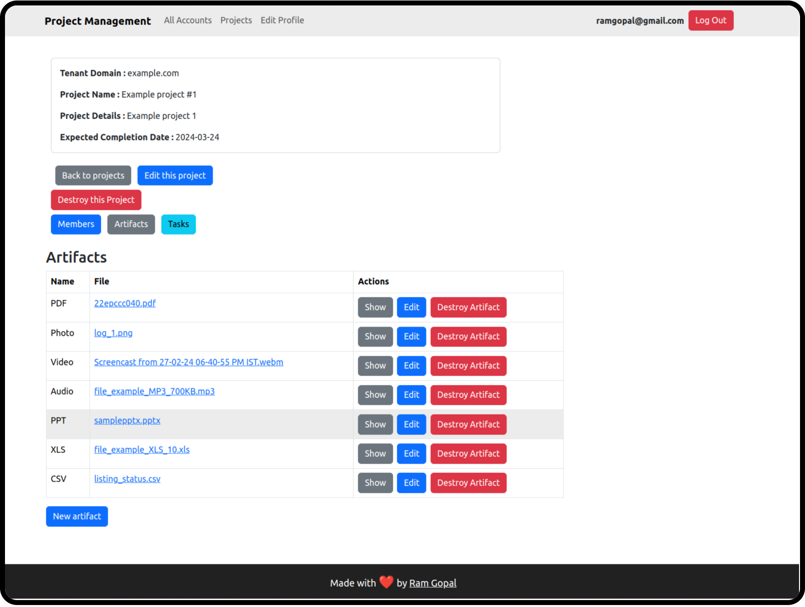

#### Members page
  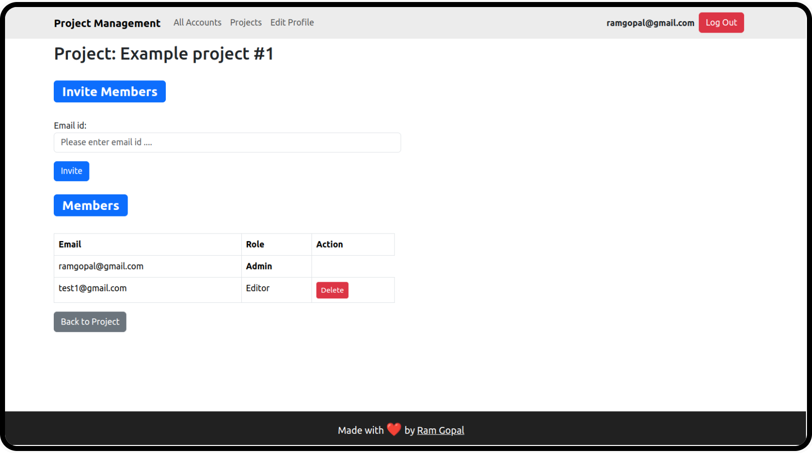

#### Show Artifacts & Create & Edit operation
  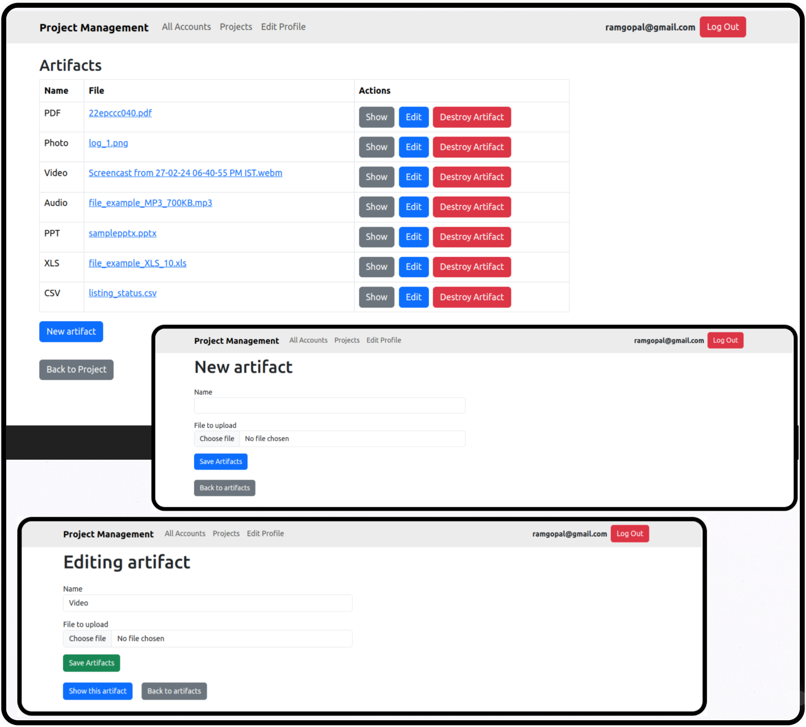

#### Show an Artifact
  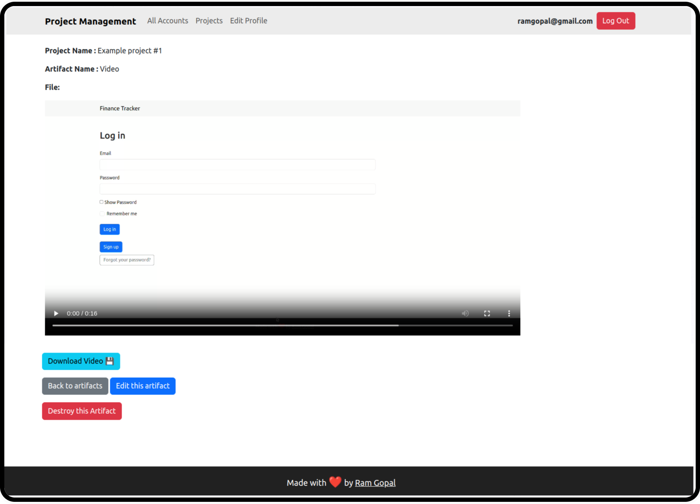

#### Show Tasks, Create & Edit operation
  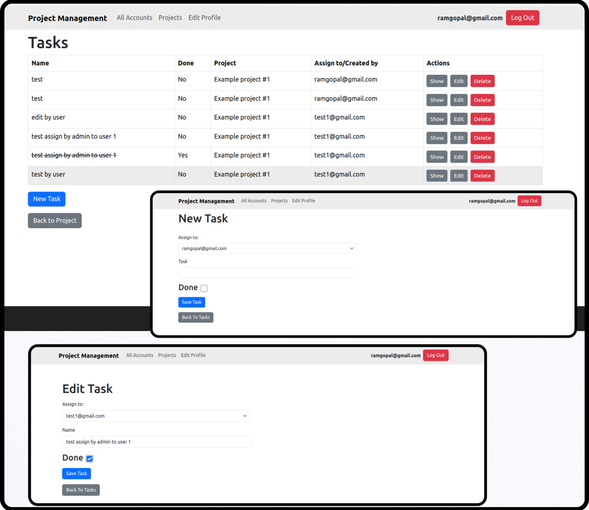

# README

This README would normally document whatever steps are necessary to get the
application up and running.

Things you may want to cover:

* Rails version: 7.1.3

* Ruby version: ruby 3.2.3 (2024-01-18 revision 52bb2ac0a6) [x86_64-linux]

* [I Foloow This Article for Add Bootstrap 5 in Rails 7  ](https://medium.com/@pietropugliesi/javascript-bootstrap-asset-bundling-in-ruby-on-rails-7-3640a220f2ce)

* Use Devise Gem for authentication for more info visit [Devise Gem's Github](https://github.com/heartcombo/devise)

* For Setup this project follow these steps
  1. Get code 
  2. Set up [Stripe API key](https://docs.stripe.com/api)
  3. Run `bundle install` for install all Gem's from Gemfile
  4. Run `rails db:migrate` for run Migrations and create db
  5. Run Server `rails server`
  6. visit [lvh.me:3000](http://lvh.me:3000/users/sign_in)

  Gem & Tech we use in Application
  1. [Acts As Tenant Gem](https://github.com/ErwinM/acts_as_tenant)
  2. [Active Storage](https://github.com/rails/rails/tree/main/activestorage)
  3. bootstrap 5 Gem
  4. devise Gem
  5. [devise bootstrap-view Gem](https://github.com/hisea/devise-bootstrap-views)
  6. [devise invitable Gem](https://github.com/scambra/devise_invitable)
  7. jbuilder Gem
  8. jquery-rails Gem
  9. dartsass-sprockets Gem
  10. stripe gem

* Configuration

* Database creation

* Database initialization

* How to run the test suite

* Services (job queues, cache servers, search engines, etc.)

* Deployment instructions

* ...
